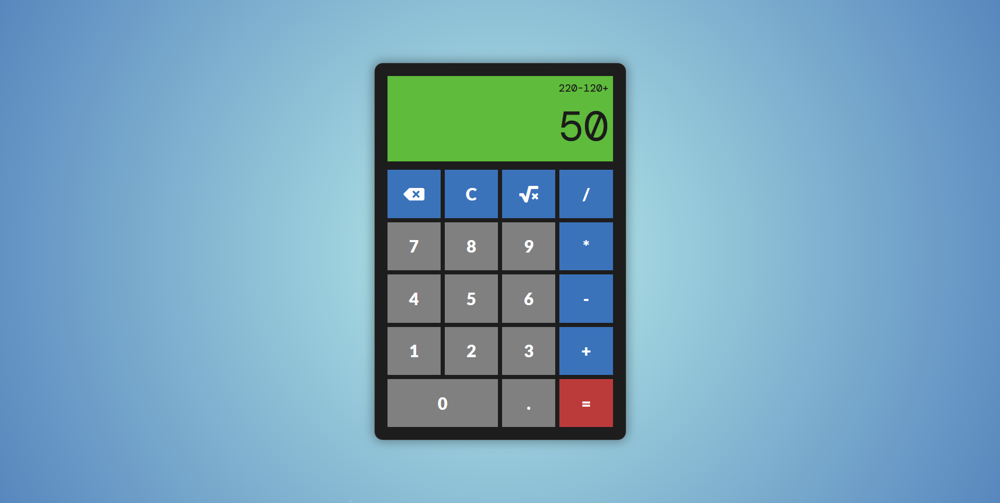

# Calculator App

> Calculator app made in JS.

## Table of contents

- [General info](#general-info)
- [Screenshots](#screenshot)
- [Technologies](#technologies)
- [Setup](#setup)
- [Status](#status)

## General info

This project was made to practice JS.

I had in mind doing a calculator since some weeks ago but didn't know how to start it. Sometimes feels like the most difficult part is how to start a project. So I started with a basic layout, added some functions (like add and subtract) and everything started to flow after that.

As I keep more functions things started to get more complicated because after fixing one thing another one broke and so on. So I ended up separating the process. One function stores the values, another one calculates the entire array, another one displays it on the screen, etc, and ended up with a bunch of functions.

I got REALLY stuck trying to limit the number of inputs.
After some days ended up setting a variable with the maximum number of inputs and another one with the number of inputs.

After a number was input the counter for number inputs would increase by 1.
If a character was deleted then the counter for number inputs would decrease by 1.
If everything was deleted then the counter would reset to 0.
And (this took me a while) if the number of the inputs was the same as the maximum inputs AND if the input wasn't a number (so + - * or /) then reset the counter to 0. This helped to keep adding inputs even after the input limit was reached.

Overall I'm happy with the project even though there's a lot of things to improve. I'll update it in the future.
Also, I'll try to make something more advanced for my next project.

## Screenshot

## Technologies

- HTML
- CSS
- JS

## Setup

- [Demo](https://kind-hawking-a33f00.netlify.app/)

## Status

Project is: _finished_
